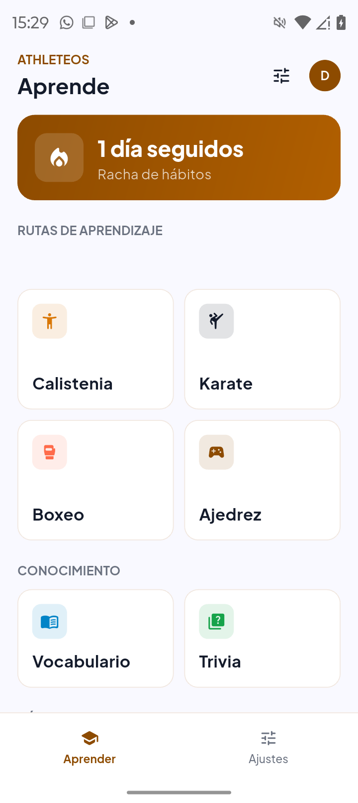
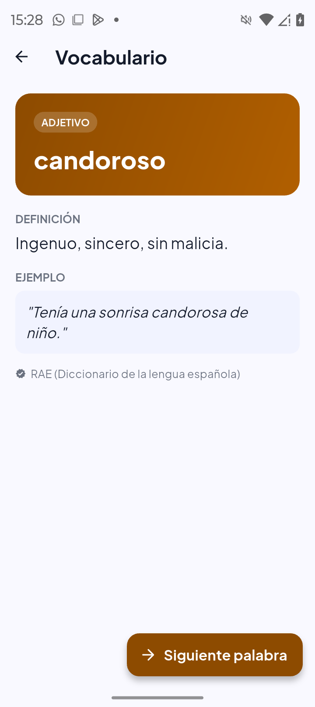
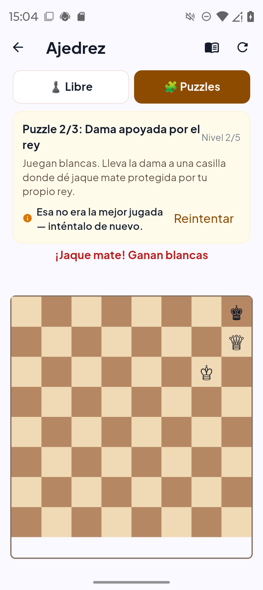
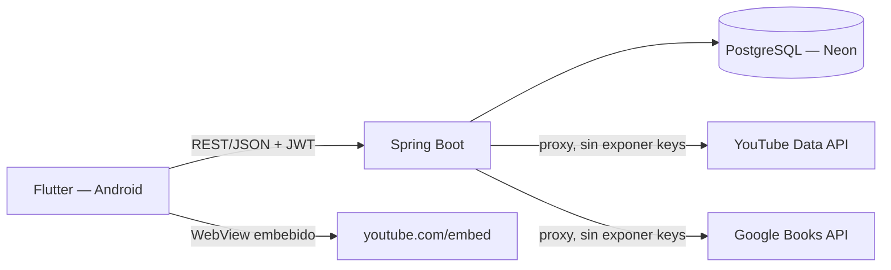

# AthletesOS

App de aprendizaje personal para Android: calistenia, karate, boxeo y ajedrez con rutas progresivas por video, más vocabulario y trivia que nunca repiten contenido, hábitos diarios y recordatorios reales de hidratación.


   

> Proyecto de uso personal (una sola cuenta), no una app pública con demo/usuario de prueba. La cuenta se crea con Google Sign-In o email/contraseña propios; no hay entorno de demostración público.





## Problema que resuelve
Las apps de aprendizaje de deportes de combate/calistenia suelen ser catálogos de video sin secuencia real (cuántas series, cuántas repeticiones, cuánto descanso), y las apps de vocabulario/trivia reciclan las mismas preguntas. AthletesOS resuelve ambas cosas con contenido real, curado y con una garantía explícita de no-repetición por usuario.

## Funcionalidades
- **Rutas de aprendizaje** (calistenia, karate, boxeo, ajedrez): temas y subtemas bloqueados hasta completar el anterior, cada uno con video real embebido en la pantalla (no redirige a otra app) y, cuando aplica, la secuencia real de series/repeticiones o rounds/duración.
- **Ajedrez jugable**: motor de reglas real (validación de movimientos, jaque/jaque mate), IA con búsqueda de 1 ply, y puzzles verificados con `python-chess` como segunda fuente de verdad.
- **Vocabulario y Trivia**: una palabra o pregunta nueva por vez; el backend garantiza que nunca se repite la misma para un usuario (se registra qué ya vio y se excluye del sorteo siguiente).
- **Hábitos diarios**: 4 hábitos base al completar el onboarding, más hábitos personalizados que el usuario agrega; racha de días consecutivos calculada por un job diario en Postgres.
- **Recordatorios reales**: notificaciones locales de hidratación (intervalo configurable) y desconexión nocturna, con permisos de alarmas exactas de Android 13+/14 manejados en la app.

## Arquitectura


## Stack y por qué
| Capa | Tecnología | Motivo |
|---|---|---|
| App | Flutter + Riverpod + go_router | Un solo código para la app real en el teléfono; Riverpod para estado reactivo sin boilerplate de BLoC. |
| Backend | Spring Boot 4 (Java 17) | Seguridad (JWT/OAuth2 resource server), validación y estructura por capas sin reinventar auth. |
| Base de datos | PostgreSQL en Neon | Free tier suficiente para un solo usuario; lógica de negocio en funciones PL/pgSQL (database-first) en vez de reimplementarla en Java. |
| Migraciones | Flyway | Esquema versionado y reproducible (27 migraciones aplicadas). |
| Video | WebView + endpoint propio (`/media/youtube-embed`) | Reproducir YouTube embebido en WebView falla (Error 152/153) si el WebView navega directo al embed; sirviéndolo desde un origen HTTP real propio, el Referer es legítimo y sí reproduce. |

## Modelo de datos
Ver [docs/modelo-datos.md](docs/modelo-datos.md) (derivado de las fuentes en [docs/investigacion.md](docs/investigacion.md)).

## Ejecutar en local

**Backend (Docker):**
```bash
cd 90-BackEnd
cp .env.example .env   # completa DB_PASSWORD, JWT_SECRET, YOUTUBE_API_KEY, GOOGLE_BOOKS_API_KEY
docker build -t athletesos-backend .
docker run --env-file .env -p 8080:8080 athletesos-backend
```

**Backend (sin Docker):**
```bash
cd 90-BackEnd
cp .env.example .env   # completa los valores
./run.sh                # carga .env y arranca (./run.ps1 en PowerShell)
```
Requiere una base PostgreSQL accesible (por defecto apunta a Neon; cambia `DB_URL` si usas otra).

**App Flutter:** con un dispositivo Android conectado por USB y `adb reverse tcp:8080 tcp:8080` (así el teléfono ve `localhost:8080` como el backend de tu PC):
```bash
flutter pub get
flutter run
```

## Variables de entorno
| Variable | Descripción | Obligatoria |
|---|---|---|
| `DB_PASSWORD` | Contraseña del rol de PostgreSQL | Sí |
| `JWT_SECRET` | Secreto HS256 para firmar JWT, Base64 estándar ≥ 32 bytes | Sí |
| `YOUTUBE_API_KEY` | Búsqueda de videos curados (YouTube Data API v3) | No (funciones de contenido curado limitadas sin ella) |
| `GOOGLE_BOOKS_API_KEY` | Catálogo de libros (Google Books API) | No |

Ninguna de estas claves llega nunca al cliente Flutter: toda llamada a una API externa pasa por un endpoint propio del backend.

## API
Swagger/OpenAPI: `http://localhost:8080/swagger-ui.html` (una vez el backend está corriendo).

| Método | Ruta | Descripción |
|---|---|---|
| POST | `/api/v1/auth/registro`, `/login`, `/google` | Autenticación (email+contraseña o Google Sign-In) |
| POST | `/api/v1/onboarding/completar-aprendizaje` | Onboarding de un solo paso: qué disciplinas aprender |
| GET | `/api/v1/rutas/{dominio}` | Ruta de aprendizaje (temas/subtemas) de un dominio |
| POST | `/api/v1/rutas/temas/{id}/completar` | Marca un subtema completado, desbloquea el siguiente |
| GET | `/api/v1/aprendizaje/palabra-nueva` | Siguiente palabra de vocabulario, nunca repetida |
| GET/POST | `/api/v1/aprendizaje/trivia-nueva`, `/trivia/{id}/responder` | Trivia sin repetición, con explicación al responder |
| GET/POST | `/api/v1/habits`, `/habits/{id}/completar` | Hábitos diarios y racha |
| GET/PUT | `/api/v1/notificaciones/configuracion` | Horarios de los recordatorios locales |
| GET | `/api/v1/media/youtube-embed` | Wrapper del embed de YouTube (ver Arquitectura) |

## Tests
```bash
cd 90-BackEnd && ./mvnw compile   # build verificado en cada cambio de este proyecto
flutter analyze && flutter test  # análisis estático + smoke test de la app
```
**Honesto:** no hay suite de tests de integración con cobertura medida en el backend todavía (todas las funciones SQL y endpoints se verificaron manualmente con llamadas HTTP reales contra la base de Neon durante el desarrollo, no con JUnit/Testcontainers). Es la brecha más grande frente al estándar de este repo — ver Roadmap.

## Despliegue (gratis)
No hay despliegue público: es una app personal que corre en un teléfono Android + un backend que puede vivir en Render free (duerme a los 15 min de inactividad, 750 h/mes) contra Neon (0.5 GB, 100 CU-h/mes).

## Seguridad aplicada
- Secretos solo por variables de entorno; `.env` nunca versionado (ver `.gitignore` y `.env.example`).
- Escaneo de secretos con gitleaks en cada push/PR (ver `.github/workflows/ci.yml`).
- Spring Security deny-by-default (`anyRequest().authenticated()`), JWT HS256 con secreto ≥256 bits desde variable de entorno, sin valor por defecto.
- API keys de terceros (YouTube, Google Books) nunca llegan al cliente: todo pasa por endpoints propios del backend.
- `/actuator` expone únicamente `health`, sin detalles internos.
- CORS no configurado de forma abierta (la app llama solo a un backend conocido por IP/host fijo, no hay frontend web público).

## Decisiones técnicas
- **Database-first**: la lógica de negocio (rachas, desbloqueo de temas, cálculo de metas) vive en funciones PL/pgSQL, no en Java — evita duplicar reglas entre capas y hace que la lógica sea auditable con SQL puro.
- **Sin repetición de contenido real, no simulada**: en vez de un banco enorme que "parece" infinito, se registra explícitamente qué vio cada usuario (`usuario_tema_progreso`, `usuario_contenido_visto`) y se excluye del siguiente sorteo — cuando el banco se agota, la app lo dice en vez de reciclar en silencio.
- **Pivote de alcance**: el proyecto empezó como un sistema de plan de 90 días (fútbol/gym/estudio con motor de generación automática); se simplificó a una app de aprendizaje pura por decisión explícita del usuario. El código del motor de planes viejo se eliminó (controladores, servicios y modelos huérfanos), no quedó deshabilitado en silencio.

## Roadmap
- [ ] Tests de integración con Testcontainers (JUnit) para elevar la cobertura del backend.
- [ ] Bloqueo de apps/webs para adultos (`UsageStatsManager` + `VpnService`) — requiere permisos manuales de Android que solo el usuario puede conceder; investigación pendiente antes de implementar.
- [ ] Ampliar el banco de vocabulario y trivia.

## Fuentes de datos y licencias
- Reglas de ajedrez y notación algebraica — FIDE Laws of Chess.
- Grados y progresión de karate — KUGB (kugb.org).
- Definiciones de vocabulario — Real Academia Española (RAE), Diccionario de la lengua española.
- Guías de hidratación — ACSM Position Stand *Exercise and Fluid Replacement*; National Academies of Sciences, Engineering and Medicine, *Dietary Reference Intakes for Water*.
- Ver [docs/investigacion.md](docs/investigacion.md) para la tabla completa fuente → fecha → qué regla salió de ahí.

## Autor
**Diego Francisco Granda Zhingre** · [GitHub](https://github.com/DiegoFranciscoG)
