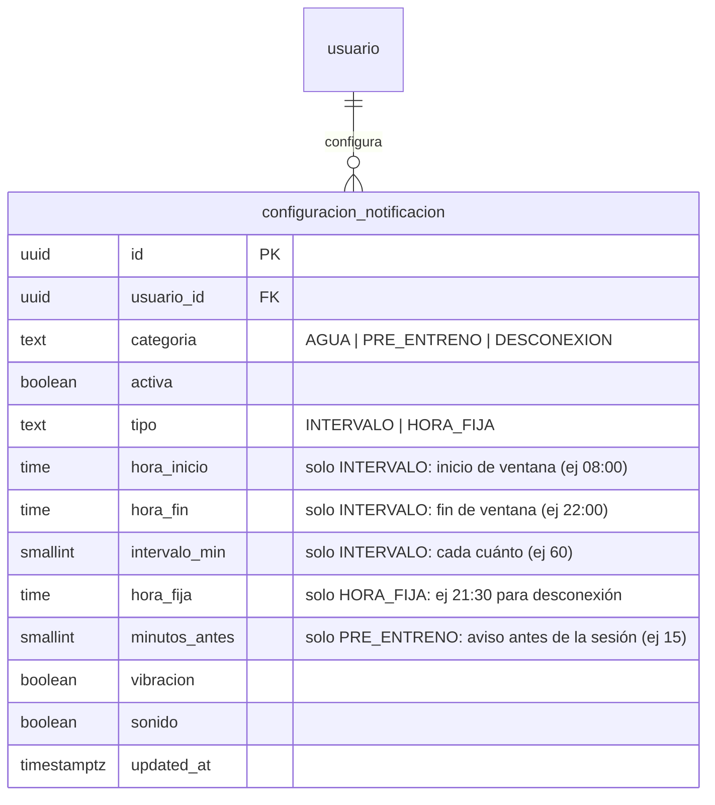

# Modelo de datos — Notificaciones tácticas + hidratación dinámica

Alcance: solo lo nuevo para esta feature. El resto del esquema (90+ tablas ya
construidas: `programa_90_dias`, `actividad_programada`, `tema`, etc.) no se
toca aquí.

## Lo que YA existe (verificado en Neon antes de diseñar nada, para no duplicar)

- `registro_hidratacion(id, usuario_id, fecha, ml, created_at)` — log
  incremental, ya tiene 13 filas reales.
- `vw_resumen_hidratacion_hoy` — vista que suma `ml` de hoy por usuario.
- `NutritionController.registrarHidratacion()` / `GET /nutrition` — ya
  persisten y devuelven `hidratacionMl` real.
- `nutrition_screen.dart` — ya tiene la barra de progreso y el botón
  `+250 ml` funcionando contra el backend real.
- **Lo único quemado ahí**: `NutritionController.java` línea 57,
  `objetivoHidratacionMl` está fijo en `2500` sin importar el usuario ni el
  día. Eso es lo que esta feature corrige.
- `flutter_local_notifications: 17.2.4` ya está en `pubspec.yaml` pero **sin
  usar en ningún archivo** (cero notificaciones programadas hoy).

## Entidad nueva: `configuracion_notificacion`

Una fila por categoría por usuario (no una tabla de eventos — los horarios
exactos de "cada cuánto suena hoy" los calcula Flutter localmente a partir de
esta configuración + la agenda del día, y se programan como notificaciones
locales de `flutter_local_notifications`; no hay tabla de "notificación
programada" en Postgres porque el disparo vive en el teléfono, no en el
servidor).

Semilla por defecto al completar onboarding (mismo patrón que ya usa
`completar_onboarding()` para crear config inicial): AGUA activa 08:00–22:00
cada 60 min, PRE_ENTRENO activa 15 min antes, DESCONEXION activa a las 21:30 —
todas editables luego desde Ajustes.

## Función nueva: `obtener_meta_hidratacion_ml(usuario_id, fecha)`

Reemplaza el `2500` quemado. Base 3000 ml (línea base National Academies para
hombres, ~80% del AI total de 3.7 L que viene de bebida) + bono si ese día hay
sesión de FUTBOL o GYM programada: `duracion_min / 60.0 * 900` (punto medio
del rango ACSM 600–1200 ml/hora), sumado por cada sesión del día. Vive en SQL
para mantener la arquitectura database-first ya usada en todo el proyecto
(igual que `generar_programa_90_dias`, `evaluar_dia_usuario`, etc.) — nunca un
número suelto en Java o Dart.

## Migración

Una sola migración nueva `V25__notificaciones_e_hidratacion_dinamica.sql`:
tabla `configuracion_notificacion` + función `obtener_meta_hidratacion_ml` +
seed de configuración por defecto para el usuario ya existente (no hace falta
tocar `completar_onboarding` todavía para no arriesgar el flujo real que ya
funciona; se seedea directo para el usuario actual y se deja un TODO explícito
para engancharlo al onboarding en un paso posterior).
